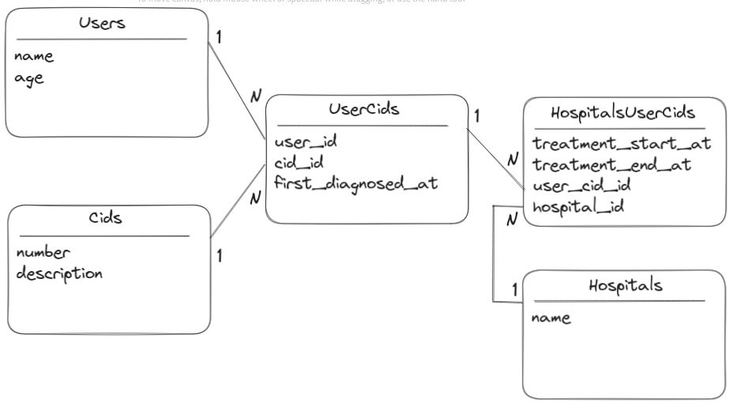

## PUTS DEV - Explorando Banco de dados com Ruby on Rails - 1º laboratório de testes

Puts dev, Querendo montar um pequeno laboratório de testes de banco de dados com Rails?

Vamos tentar gerar um banco que te permita fugir do básico,
criar uma quantidade de dados e ligações que permitam explorar consultas em bancos de dados.

*A ideia aqui é apenas gerar o banco, logo mais devo trazer um conteúdo explorando esse banco :)

Youtube:
https://youtu.be/Tyjo3xMihNk

